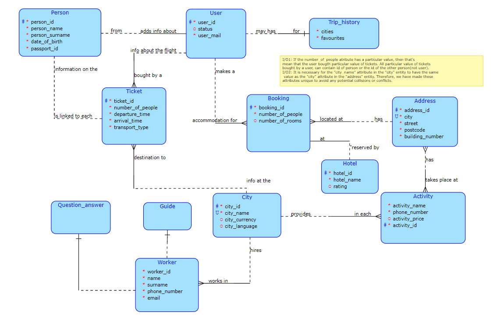
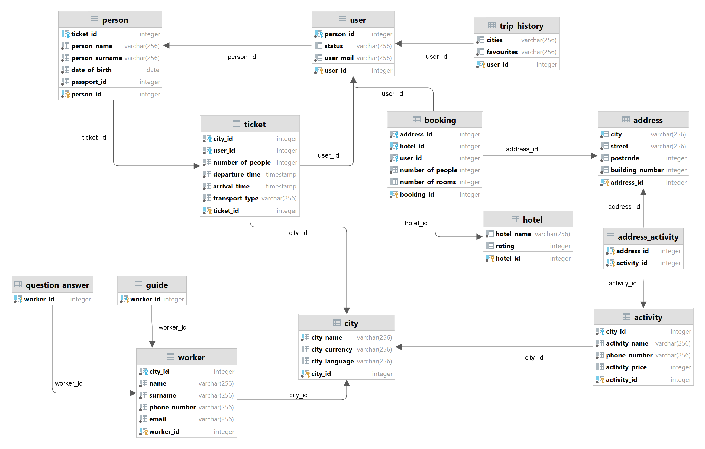

# Travel planning app

The travel planning application "Sapar" helps the user with buying tickets and booking. To register in the application, the user must enter his email address, after that user can choose his/her status. Each user will have access to his/her travel history, that contains information about cities user visited and favourite cities list . The user can buy several tickets at the same time, but the personal data of each person (name, surname, date of birth, passport number) must be filled. After purchase, the ticket will contain all the information related to the flight, i.e. the ticket will indicate the number of people, thedeparture time, the arrival time and thetransport type on which the trip will be made. Booking entity provides the information about the number of people the hotel was booked for and the number of rooms will be available to the user, hotel's name and it's rating among other hotel will be available in hotel entity. The address of the booking in which the user moves will have the city in which he is located, the post code of the booking, the street and the number of the building. Basic information about the city, its name, the currency , as well as the language spoken in this city will be available. Each city has a worker who will be responsible for particular tasks. Worker's name, surname, phone number and email will be available for the additional information. Depending on your question you can either call Q/A for specific questions or you can call guide if you want a personal tour in city. The app will provide some tips and recommendations such as activity in each city. There are different names of activities of activities such as museums, theaters and various restaurants, each place is tied to its price and a phone number for consultation. Each activity has an address associated with it as well.

# Conceptual schema

# Relational schema

